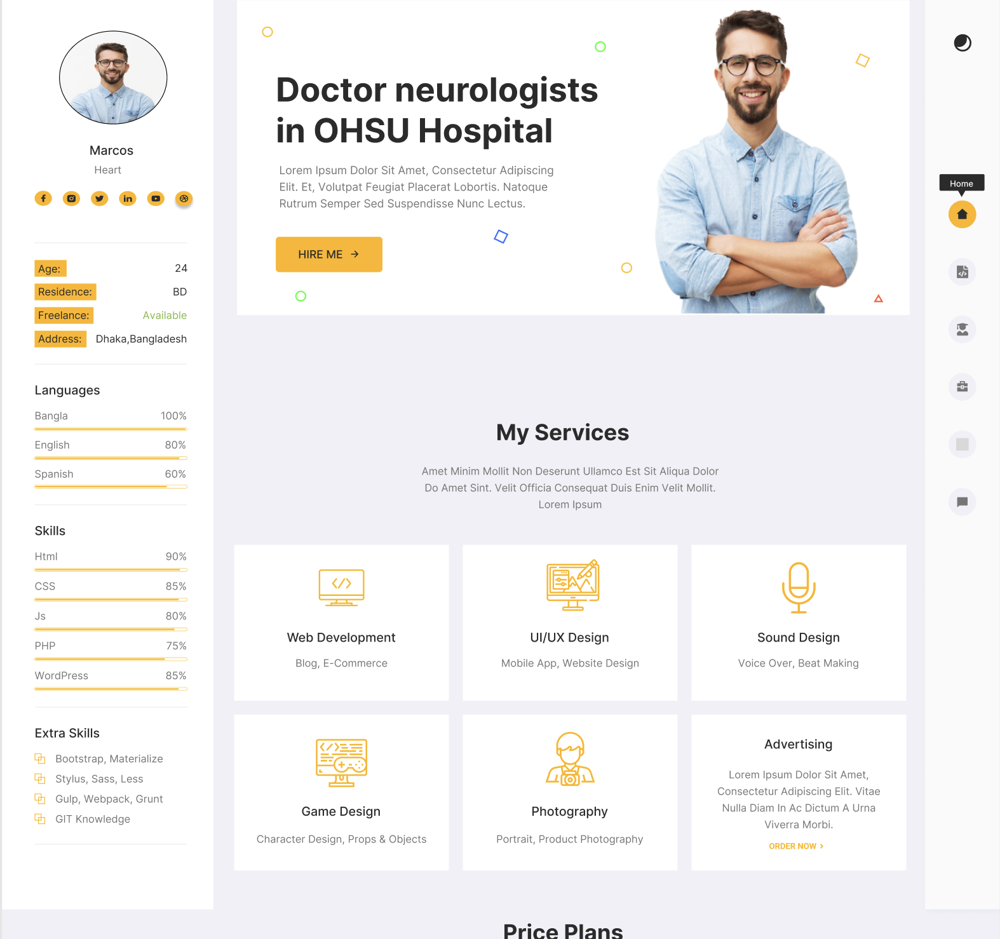

# 👨‍💻 Steve - Personal Portfolio Website

## 📱 Preview

### Desktop View

## 📖 About The Project

**Steve Portfolio** is a personal portfolio website showcasing my skills, services, and projects as a software engineer. Built with modern web technologies and featuring a clean, professional design with user-friendly interface.

### ✨ Key Features

- 🏠 **Professional Design** - Modern and clean professional appearance
- 👤 **About Section** - Personal information and biography
- 💼 **Services** - Comprehensive list of offered services
- 🛠️ **Skills Display** - Skills showcase with proficiency levels
- 📱 **Fully Responsive** - Optimized for all devices
- 🌟 **Clean UI/UX** - Simple and intuitive interface
- ⚡ **Fast Loading** - Quick loading and efficient performance
- 📧 **Contact Information** - Easy ways to get in touch

## 🛠️ Built With

### Backend Technologies

- **[Node.js](https://nodejs.org/)** - JavaScript runtime environment  
- **[Express.js](https://expressjs.com/)** - Web framework  
- **[MongoDB](https://mongodb.com/)** - NoSQL database  
- **[EJS](https://ejs.co/)** - Template engine  

### Frontend & Styling

- **[CSS3](https://developer.mozilla.org/en-US/docs/Web/CSS)** - Modern styling  
- **[JavaScript](https://developer.mozilla.org/en-US/docs/Web/JavaScript)** - Dynamic functionality  
- **[Responsive Design](https://developer.mozilla.org/en-US/docs/Learn/CSS/CSS_layout/Responsive_Design)** - Adaptive design  

### Tools & Libraries

- **File System (fs)** - File handling operations
- **Custom CSS** - Custom styling and animations
- **Modern JavaScript** - ES6+ features and functionality

## 🎯 Features Overview

### 👤 Personal Information

- **Professional Photo** - Personal image with professional presentation
- **Contact Details** - Age, location, and language skills
- **Social Links** - Social media connections

### 💼 Services Section

- **Web Development** - Blog and E-Commerce solutions
- **UI/UX Design** - Mobile App and Website Design
- **Sound Design** - Voice Over and Beat Making
- **Game Design** - Character Design, Props & Objects
- **Photography** - Portrait and Product Photography
- **Advertising** - Marketing and promotional services

### 🛠️ Skills Display

- **Programming Languages** - Proficiency levels in various technologies
- **Progress Bars** - Visual representation of skill levels in percentages
- **Technology Stack** - Comprehensive list of used technologies

### 📱 Responsive Design

- **Mobile Friendly** - Optimized for mobile devices
- **Cross-Browser** - Compatible with all modern browsers
- **Fast Performance** - Quick loading and high efficiency

## 🎨 Design Features

### Color Scheme

- **Primary Colors** - Professional blue and yellow color palette
- **Clean Layout** - Organized and structured arrangement
- **Modern Typography** - Contemporary fonts and text styling

### Interactive Elements

- **Hover Effects** - Smooth animations on mouse interactions
- **Smooth Scrolling** - Fluid page navigation
- **Progress Animations** - Animated skill level indicators

## 🤝 Contributing

To contribute to this project:

1. **Fork** the repository
2. **Create** a feature branch
3. **Commit** your changes
4. **Push** to the branch
5. **Open** a Pull Request

## 👨‍💻 Author

**KhamzaevAsad** - Software Engineer

- **Email** - xamzayevasad4422gmail.com
- **Location** - South Korea, Chuncheon
- **Specialization** - Full Stack Development

---

  
Made with  by KhamzaevAsad

  
© 2025 Steve Portfolio. All rights reserved.

